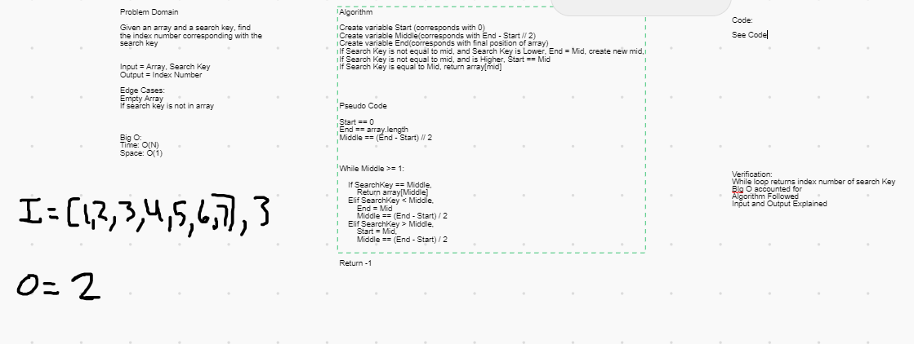

# Data Structure Implementation: Array Binary Search
---

## BinarySearch

*Authors: Ashley Casimir and Robert Carter*

---

## Description

A Python implementation of a `Binary Search`. Binary are utilized to find numbers within existing arrays.

---

## Functions

| Function | Summary | Big O Time | Big O Space | Example | 
| :----------- | :----------- | :-------------: | :-------------: | :----------- |
| BinaryArray | Finds a number within an array and returns it's index value | O(N) | O(1) | BinarySearch [10, 11, 12, 13], 12 => 2 |

---
### Approach

#### BinarySearch()
1. Create variable Start (corresponds with 0)
2. Create variable Middle(corresponds with End - Start // 2)
3. Create variable End(corresponds with final position of array)
4. While Middle >= 1
5. If Search Key is not equal to mid, and Search Key is Lower, End = Mid, create new mid,
6. If Search Key is not equal to mid, and is Higher, Start == Mid
7. If Search Key is equal to Mid, return array[mid]

### Efficiency
* Methods that have Big O efficiency O(N) for time
  * BinarySearch(). Because we are adding one or more nubmers at a time in a single array, it gets longer to do at a set rate
  
* Methods that have Big O efficiency O(1) for space
  * BinarySearch(). Because it is only a single array with numbers, each added takes up the same amount of space, thus adding space at a linear rate
  
  
## Visuals

---

## Change Log
1.1 Finished Challenge 3 - 14 December 2020
