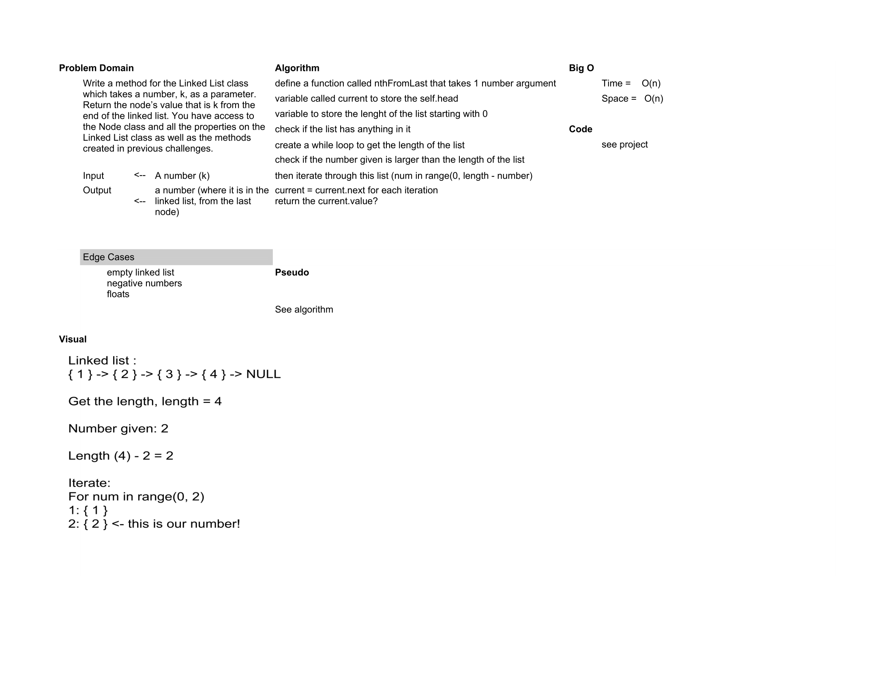

# Data Structure Implementation: Linked Lists
---

## insertShiftArray

*Authors: Robert Carter, Amber Falbo, Anthony Beaver, Audrena Vacirca, Kim Damalas*
*Got some information from Vince Maston (TA). Code was "mob coded" by the above group*

---

## Description

A Python implementation of a "`Linked List`. Linked Lists are collections of nodes which have a particular value. One is able to manipulate and pull data from these linked lists utilizing a series of commands. 

---

## Functions

| Function | Summary | Big O Time | Big O Space | Example | 
| :----------- | :----------- | :-------------: | :-------------: | :----------- |
| .append(value) | Adds a new node with the given value to the end of the list | O(1) | O(1) | .append(value)1 -> 2-> 3 -> None, 4 => 1 -> 2 -> 3 -> 4 -> None |

.insertBefore(value, newVal) |  Adds a new node with the given newValue immediately before the first value node | O(1) | O(1) | .insertBefore(value, newVal)1 -> 2-> 3 -> None, 2, 5 => 1 -> 5 -> 2 -> 3 -> 4 -> None |

.insertAfter(value, newVal) |  Adds a new node with the given newValue immediately after the first value node | O(1) | O(1) | .insertAfter(value, newVal)1 -> 2-> 3 -> None, 1, 4 => 1 -> 4 -> 2 -> 3 -> None |

---
### Approach

#### .append(value)
1. create linked_list, create Node
2. var for int to append = Node(val)
3. if current.head.next = None?
4. return self.head = new var
5. while loop, check for while current.next is != None
6. if current.next = None, current.next = var
7. return current = new var

#### .insertBefore(value, newVal)
1. def function with two arg (value, new value)
2. var to store( new_node) = Node(new Value)
3. if self.head = value
4. new_node.next = self.head
5. self.head = new_node
6. return 
7. while(current.value does not = new_node.value
8. current = current.next
9. new_node.next = current 
10. return

#### .insertAfter(value, newVal)
1. def function with two arg (value, new value)
2. var to store( new_node) = Node(new Value)
3. if self.head = value
4. self.head.next = new_node
5. self.head = new_node
6. return 
7. while(current.value does not = new_node.value
8. current = current.next
9. current.next = new_node
10. return

### Efficiency
* Methods that have Big O efficiency O(N) for time
  * .append(value). traversing each node to find value
  * .insertBefore(value, newVal). traversing each node to find value
  * .insertAfter(value, newVal). traversing each node to find value
  
* Methods that have Big O efficiency O(N) for space
  * .append(value). depends on how many nodes are in list
  * .insertBefore(value, newVal). depends on how many nodes are in list
  * .insertAfter(value, newVal). depends on how many nodes are in list
  
  
## Visuals

---

## Change Log
1.1 Finished Challenge 6 - 22 December 2020
