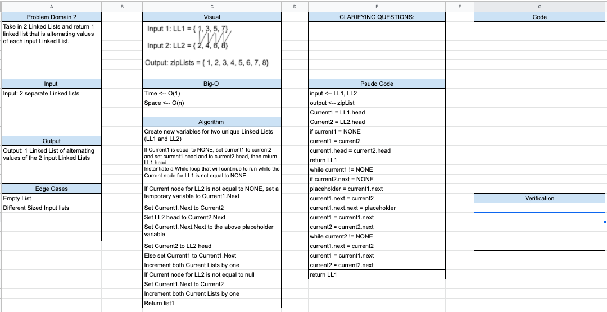

# Data Structure Implementation: Zip Lists
---

## zipList

*Authors: Robert Carter, Nick Dorkins*
*Got some information from my ASP.NET notes*

---

## Description

A Python implementation of a "`Zip List`. Zip Lists, in this particular instance, are utilized to merge two linked lists in an alternating node fashion. Once completed, the new linked list is returned.

---

## Functions

| Function | Summary | Big O Time | Big O Space | Example | 
| :----------- | :----------- | :-------------: | :-------------: | :----------- |
| zipLists(LL1, LL2) | Merges two linked lists by alternating nodes | O(1) | O(n) | zipLists(LL1, LL2)1 -> 2-> 3 -> None, 5 -> 6 -> 7 -> 8 -> None => 1 -> 5 -> 2 -> 6 -> 3 -> 7 -> 4 -> 8 -> None |

---
### Approach

#### zipList(LL1, LL2)
1. Create new variables for two unique Linked Lists (LL1 and LL2)
2. If Current1 is equal to NONE, set current1 to current2 and set current1 head and to current2 head, then return LL1 head
3. Instantiate a While loop that will continue to run while the Current node for LL1 is not equal to NONE
4. If Current node for LL2 is not equal to NONE, set a temporary variable to Current1.Next
5. Set Current1.Next to Current2
6. Set LL2 head to Current2.Next
7. Set Current1.Next.Next to the above placeholder variable
8. Set Current2 to LL2 head
9. Else set Current1 to Current1.Next
10. Increment both Current Lists by one
11. Return LL1

### Efficiency
* Methods that have Big O efficiency O(1) for time
  * zipList(LL1, LL2). traversing each node to find value and adding LL2 nodes into LL1
  
* Methods that have Big O efficiency O(n) for space
  * zipList(LL1, LL2). depends on how many nodes are in lists

  
  
## Visuals

---

## Change Log
1.1 Finished Challenge 8 - 4 January 2021